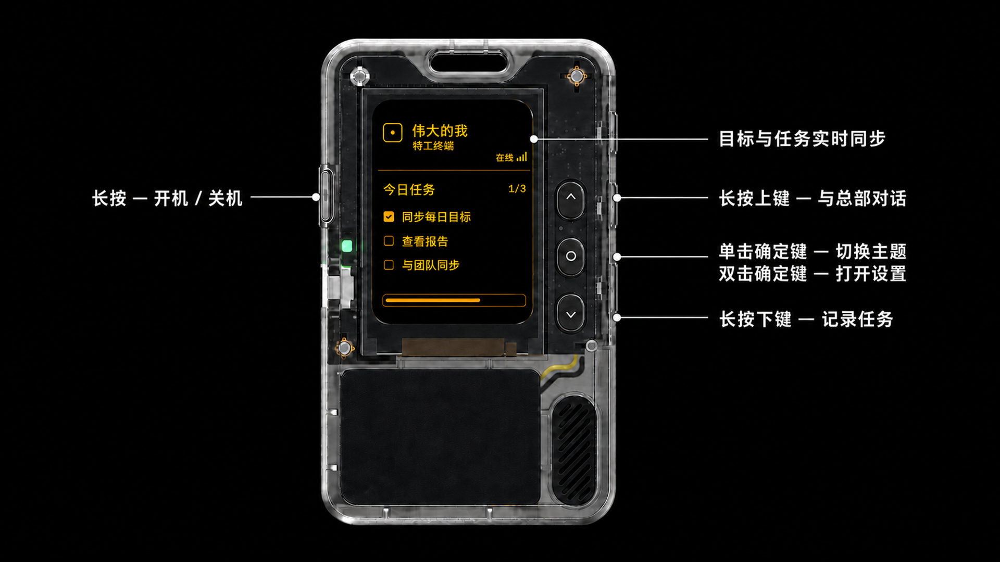

<p align="right">
  <a href="README.md">English</a> · <strong>简体中文</strong>
</p>

# TheGreatMe Passport

这套开源固件把 FoloToy AI Passport 变成 TheGreatMe 的随身任务与语音终端：显示目标和
今日任务，向总部发送语音，并通过 iPhone 配套端接收文字与语音回复。



## 用一段 Prompt 完成搭建

复制下面整段内容，发送给 Codex、Claude Code、Cursor 或其他 coding agent：

```text
请帮我自动搭建并编译 TheGreatMe Passport：
https://github.com/Johnnydaszhu/TheGreatMe_Passport

请自主完成任务，仅在环境确实要求授权时向我申请权限。

1. 克隆仓库，然后先阅读 AGENTS.md、docs/development/environment-setup.md 和
   docs/development/build-and-test.md，再进行任何修改。
2. 必须使用 ESP-IDF v5.5.3 和 esp32c3 target。优先复用版本匹配的本地环境；如需安装，
   请与其他版本并存，不要替换现有版本。
3. 运行 ./tools/validate.sh，只修复通过环境配置或编译门禁所必需的问题。
4. 如果已连接 FoloToy AI Passport，请自动识别真实串口，仅把
   build/FoloToy-AI-Passport.bin 写入 0x10000，并校验烧录摘要。禁止擦除整片 Flash，
   禁止覆盖 0x356000 的 cardid 和 0x700000 的 Recovery。
5. 分别汇报 Build、Host tests、Device tests 和 Unverified，并告诉我两个固件文件的路径。

除非我明确要求，否则不要改变产品功能，不要 git commit，也不要 push。
```

## 日常操作

- 长按左侧按键开机或关机。
- 长按**上键**与总部对话；总部语音播放时短按上键可立即停止。
- 长按**下键**记录并整理任务。
- 短按**上键/下键**切换任务。
- 短按**确定键**切换主题；双击确定键才进入设置页面。

## 输出与安全

- `build/FoloToy-AI-Passport-full.bin`：用于分发的已验证合并镜像。
- `build/FoloToy-AI-Passport.bin`：用于安全应用分区烧录的固件。
- 不要擦除已经配置的 Passport，必须保留设备身份和永久 Recovery。

任务同步、语音识别、AI 回复和语音播放需要 TheGreatMe iPhone 配套端。详细的环境配置、
协议、硬件和贡献文档位于 [`docs/`](docs/)。本项目基于
[`FoloToy/ai-passport`](https://github.com/FoloToy/ai-passport)，采用
[MIT License](LICENSE)。
