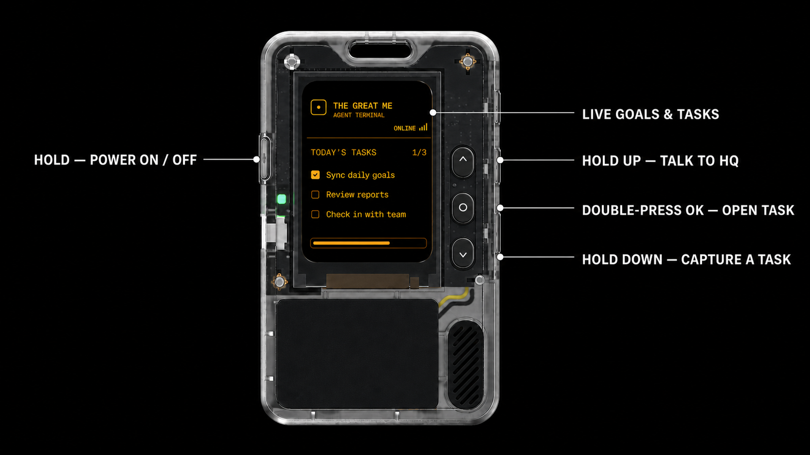

<p align="right">
  <strong>简体中文</strong> · <a href="README.md">English</a>
</p>

# AI Passport × TheGreatMe 特工终端

这套固件把 FoloToy AI Passport 变成 TheGreatMe 的随身任务与语音终端。ESP32-C3
设备会显示当前目标和今日任务，通过两个按住说话入口录音，并经加密蓝牙从 iPhone
接收文字与语音回复。

本仓库只包含**设备固件**。任务同步、语音识别、AI 回复和回复语音依赖单独维护的
TheGreatMe iPhone 桥接端；没有配套 App 时，固件仍能启动并广播 BLE，但无法完成整套
联动流程。

## 产品操作图



这张 16:9 操作图标出了终端屏幕、左侧电源键，以及右侧用于任务和语音操作的上键、
确定键与下键；终端 UI 和外部标注均使用英文，便于公开展示。

## 已实现

- 240 × 320 单色终端任务看板，内置四种可切换主题。
- 配套载荷可切换简体中文、繁体中文、英语、西班牙语、法语、德语、韩语和日语界面。
- 接收周、月、年目标以及最多五条今日任务。
- 区分待办、受阻和已完成三种任务状态。
- 长按上键进入总部对话，长按下键整理任务；两条路径均上传 16 kHz IMA ADPCM 录音。
- 显示回复文字并播放 8 kHz IMA ADPCM 语音，同时兼容旧版 16 kHz 回复音频块。
- 加密 GATT 特征与持久化 iPhone 配对。
- 开机直接进入终端；长按确定键仍可返回硬件 Demo 菜单进行诊断。
- 覆盖任务看板协议、ADPCM 编解码和 UI 像素计算的主机测试。

## 按键

| 按键 | 任务主页 | 任务全屏页 | 对话页 | 设置页 |
| --- | --- | --- | --- | --- |
| 单击上键 | 上一条任务 | 上一条任务 | 返回任务主页 | 返回 |
| 单击下键 | 下一条任务 | 下一条任务 | 返回任务主页 | — |
| 长按上键 | 录制总部对话 | 录制总部对话 | 继续录制对话 | — |
| 长按下键 | 录制任务整理内容 | 录制任务整理内容 | 录制任务整理内容 | — |
| 单击确定键 | 打开设置 | 打开设置 | 打开设置 | 切换主题 |
| 双击确定键 | 全屏查看所选任务 | 返回任务主页 | — | — |
| 长按确定键 | 返回硬件 Demo 菜单 | 返回硬件 Demo 菜单 | 返回硬件 Demo 菜单 | 返回硬件 Demo 菜单 |

## BLE 协议

配套服务使用 16 位 UUID `0xA2B0`：

| UUID | 方向 | 用途 |
| --- | --- | --- |
| `0xA2B1` | iPhone → Passport | 任务看板与对话快照 |
| `0xA2B2` | Passport → iPhone | 控制事件与语音会话事件 |
| `0xA2B3` | Passport → iPhone | 麦克风音频 |
| `0xA2B4` | iPhone → Passport | 回复音频 |

紧凑任务看板载荷见
[`main/passport_protocol.h`](main/passport_protocol.h)。公开测试数据或日志前，请移除
真实姓名、对话、目标和任务内容。

## 构建与验证

需要 FoloToy AI Passport、ESP-IDF 5.5.3，以及已安装的 `esp32c3` 工具链。

```bash
source <ESP-IDF-v5.5.3-路径>/export.sh
idf.py --version
./tools/validate.sh
```

完整门禁会运行仓库检查、主机测试、隔离固件构建和合并镜像校验，生成：

- `build/FoloToy-AI-Passport-full.bin`：用于分发的已验证合并镜像。
- `build/FoloToy-AI-Passport.bin`：供小程序安装的应用载荷。

烧录前阅读
[`docs/development/build-and-test.zh_CN.md`](docs/development/build-and-test.zh_CN.md)。不要擦除
已配置设备：必须保留 `0x356000` 的设备身份数据和 `0x700000` 的永久 Recovery。编译通过
不能替代真机验证。

## 仓库结构

```text
main/                    应用 UI、BLE、音频与协议代码
components/bsp/          板级支持与硬件接口
tests/                   不依赖硬件的主机测试
tools/                   本地与 CI 验证工具
docs/                    硬件、构建、贡献与安全文档
assets/                  可复用素材的来源和授权说明
```

使用 AI 协作前从 [`AGENTS.zh_CN.md`](AGENTS.zh_CN.md) 开始；普通贡献见
[`CONTRIBUTING.zh_CN.md`](.github/CONTRIBUTING.zh_CN.md)。硬件事实与约束以继承自上游的
[`AI 硬件开发指南`](docs/hardware-design/AI_HARDWARE_DEVELOPMENT_GUIDE.zh_CN.md)为准。

## 上游与许可证

这是基于 [`FoloToy/ai-passport`](https://github.com/FoloToy/ai-passport) 开发的下游产品固件。
上游更新需要先审查再显式合入，不通过无人值守任务直接写入当前产品分支。

源代码使用 [MIT License](LICENSE)。内嵌的 Source Han Sans 位图字库继续使用 SIL Open
Font License 1.1，详见
[`assets/fonts/SourceHanSans-LICENSE.txt`](assets/fonts/SourceHanSans-LICENSE.txt)和
[字库说明](assets/fonts/README.zh_CN.md)。
